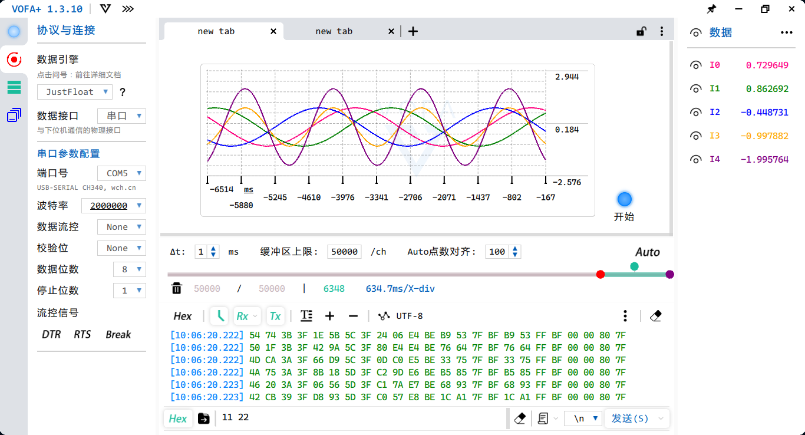
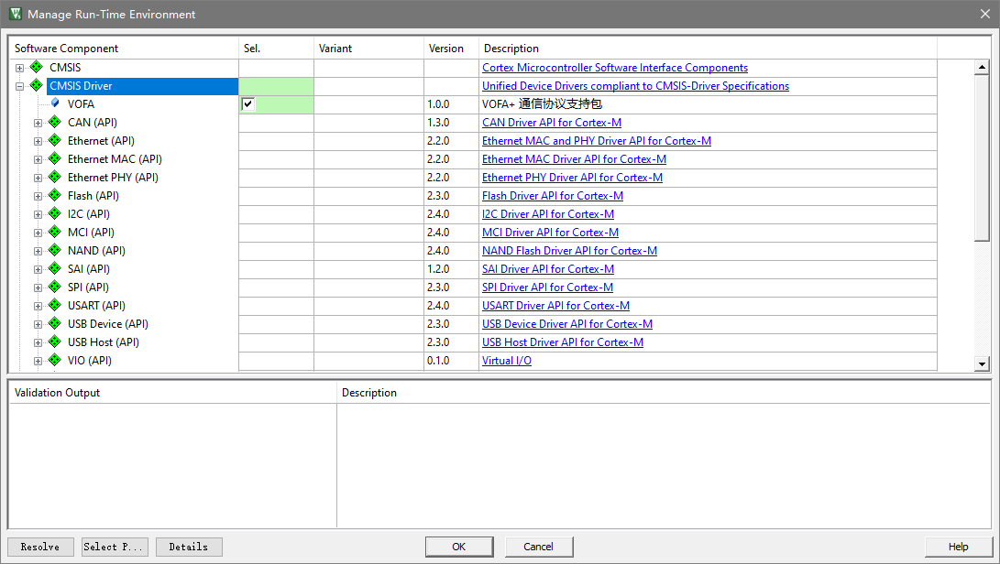

## VOFA+ 通信协议支持框架

本框架是VOFA+串口调试软件的通信协议驱动，支持三种默认的通信协议：FireWater, JustFloat 以及 RawData

---

### VOFA+



#### VOFA+ 介绍

Vofa+ 是一个可扩展，高颜值的串口调试软件，除了基本的串口调试的功能，还支持TCP/IP通信、数据可视化、数据分析等高级功能，可以大大方便我们日常的开发调试和提高效率。

关于VOFA的更多信息请访问：

- Vofa+ 官方网站：[https://www.vofa.plus/](https://www.vofa.plus/)

- Vofa+ 入门：[https://www.vofa.plus/docs/learning](https://www.vofa.plus/docs/learning)

- Vofa+ 下载：[https://www.vofa.plus/downloads/?index=0](https://www.vofa.plus/downloads/?index=0)

- 【bilibili】一个调试软件： [https://www.bilibili.com/video/BV15T4y157sF?from=search&seid=13384434154216853241](https://www.bilibili.com/video/BV15T4y157sF?from=search&seid=13384434154216853241)

- 【bilibili】用串口给火箭调参的正确姿势：[https://www.bilibili.com/video/BV1YK4y157Rb?from=search&seid=13384434154216853241](https://www.bilibili.com/video/BV1YK4y157Rb?from=search&seid=13384434154216853241)

#### VOFA+ 的三种通信协议

[RawData](https://www.vofa.plus/plugin_detail/?name=RawData): 最基本的通信协议，接收到什么，便打印什么，不做数据的解析处理，仅用于查看字节流数据。

[JustFloat](https://www.vofa.plus/plugin_detail/?name=JustFloat): 本协议是小端浮点数组形式的字节流协议，纯十六进制浮点传输，节省带宽。此协议非常适合用在通道数量多、发送频率高的时候。

[FireWater](https://www.vofa.plus/plugin_detail/?name=FireWater): 本协议是CSV风格的字符串流，直观简洁，编程像printf简单。但由于字符串解析消耗更多的运算资源（无论在上位机还是下位机），建议仅在通道数量不多、发送频率不高的时候使用。

---

### VOFA+ 通信协议框架的使用

该框架理论上支持任何平台，作用与硬件之上，用户需要在框架的外部初始化和配置相关通信接口。

#### 1. 通信接口

```c
void Vofa_SendDataCallBack(Vofa_HandleTypedef* handle,uint8_t* data,uint16_t length);
uint8_t Vofa_GetDataCallBack(Vofa_HandleTypedef* handle);
```

上面两个函数与硬件相关，用户必须根据通信硬件重写上述接口，例如在GD32中的串口：

```c
void Vofa_SendDataCallBack(Vofa_HandleTypedef* handle,uint8_t* data,uint16_t length)
{
	uint16_t i;
	for(i = 0;i<length;i++)
	{
		usart_data_transmit(USART1,data[i]);
		while(RESET == usart_flag_get(USART1,USART_FLAG_TBE));
	}
}

uint8_t Vofa_GetDataCallBack(Vofa_HandleTypedef* handle)
{
	return usart_data_receive(USART1);
}
```

#### 2. 数据类型

**Vofa_FIFOTypeDef**: 用于存储接收到的数据

- **buffer** : 内存空间
- **rp**: 读指针
- **wp**: 写指针

```c
typedef struct
{
	uint8_t buffer[VOFA_BUFFER_SIZE];			//Data buffer
	uint8_t* rp;						//Read data buffer pointer
	uint8_t* wp;						//Write data buffer pointer
	bool overflow;						//FIFO overflow sign bit
}Vofa_FIFOTypeDef;
```


**Vofa_ModeTypeDef**: FIFO的工作模式

- **VOFA_MODE_SKIP** ：当FIFO溢出时不发生阻塞，覆盖数据。
- **VOFA_MODE_BLOCK_IF_FIFO_FULL**: 当FIFO溢出时发生阻塞，等待数据被读取释放FIFO缓存。

```c
typedef enum
{
	VOFA_MODE_SKIP, 				// Do not block
	VOFA_MODE_BLOCK_IF_FIFO_FULL 	// Wait until there is space in the buffer.
}Vofa_ModeTypeDef;
```


**Vofa_HandleTypedef**: VOFA+ 通信协议框架抽象模型的句柄

- **txBuffer** : 传送数据时用到的缓存空间
- **rxBuffer**: 读取数据时用到的FIFO缓存空间
- **mode**: FIFO工作模式

```c
typedef struct
{
	uint8_t txBuffer[VOFA_BUFFER_SIZE];
	Vofa_FIFOTypeDef rxBuffer;
	Vofa_ModeTypeDef mode;
}Vofa_HandleTypedef;
```

#### 3. 宏

该框架存在两个宏，需要用户进行配置：

- **VOFA_BUFFER_SIZE**：缓存大小，接收FIFO缓存大小和发送缓存大小都通过该宏配置。
- **VOFA_CMD_TAIL**：命令的帧尾，例如: {0xAF,0xFA}

#### 4. 函数

```c
void Vofa_Init(Vofa_HandleTypedef* handle,Vofa_ModeTypeDef mode);

/* send data functions */
void Vofa_SendData(Vofa_HandleTypedef* handle,uint8_t* data,uint16_t num);
void Vofa_JustFloat(Vofa_HandleTypedef* handle,float* data,uint16_t num);
void Vofa_Printf(Vofa_HandleTypedef* handle,const char* format,...);

/* receive data functions */
void Vofa_ReceiveData(Vofa_HandleTypedef* handle);
uint16_t Vofa_ReadCmd(Vofa_HandleTypedef* handle,uint8_t* buffer,uint16_t bufferLen);
uint16_t Vofa_ReadLine(Vofa_HandleTypedef* handle,uint8_t* buffer,uint16_t bufferLen);
uint16_t Vofa_ReadData(Vofa_HandleTypedef* handle,uint8_t* buffer,uint16_t bufferLen);
```

- Vofa_Init：初始化一个Vofa通信协议框架抽象模型
- Vofa_SendData：发送字节流到VOFA+，**num**是发送字节数量。
- Vofa_JustFloat： 根据JustFloat协议发送一些浮点数到VOFA，**num**是浮点数的数量。
- Vofa_Printf：类似printf函数，发送格式字符串到VOFA，可用于匹配FireWater协议。
- Vofa_ReceiveData：接收一个字节到FIFO，典型应用在串口接收中断中。
- Vofa_ReadCmd：从FIFO中读取一个命令，该命令的帧尾通过宏**VOFA_CMD_TAIL**来配置，**buffer是接收命令字节的外部缓存空间，bufferLen是该缓存空间的大小，返回读取到的字节数**。
- Vofa_ReadLine：从FIFO中读取一行字符串，其他参数同上。
- Vofa_ReadData： 从FIFO中读取数据，如果FIFO数据长度小于bufferLen，则读取全部的数据。

#### 5. Demo

详见Demo/GD32F303RC


#### 6.CMSIS Package

可下载安装本项目的Release：[Freedom.VofaPlus.x.x.x.pack](https://github.com/skjsnb/VOFA-Protocol-Driver/releases)



在Keil的包管理器中勾选VOFA即可快速使用。